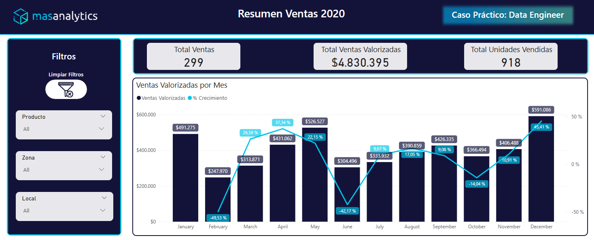
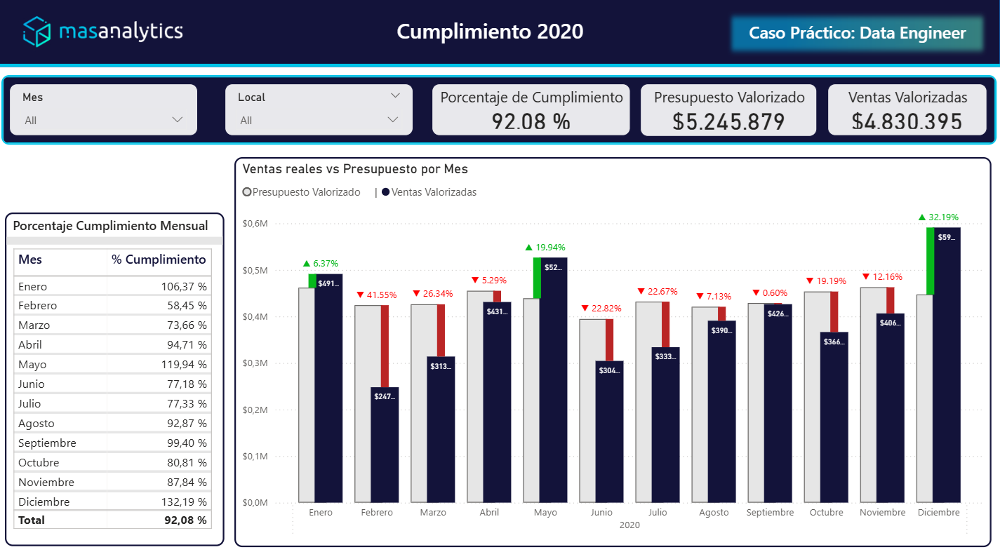
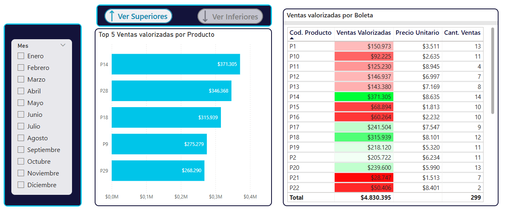

# Sales-Dashboard

This dashboard presents insights from a fictional sales dataset. It was built in Power BI within a single day as part of a job application.
The dataset contains only data from the year 2020, and a dimensional data model was applied for use in this dashboard.

## Views of the dasboard

The following are some views of the dashboard:

**Monthly Sales with Behaviour**

It Allows you to visualize the sales behavior over monthly periods, including their growth trends.

**Analysis by Stores**

This heatmap allows users to visualize monthly sales by store.

**Performance Compliance**

This view features a bar chart designed according to IBCS standards to clearly illustrate the comparison between sales and budget performance.

**Seasonality**

This section of the seasonality sheet allows for dynamic visualization of product sales behavior throughout the months of the year 2020.

